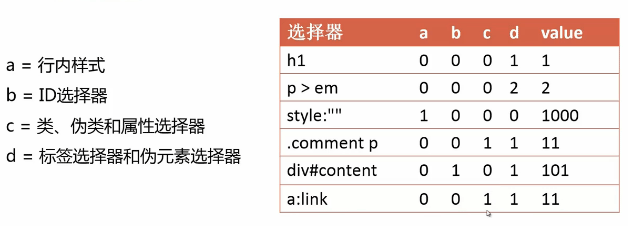

# 简单选择器

### 标签选择器
```css
tag{属性:值;}
p{color:blue;}
```

### 类选择器
```css
.class(属性:值;) /*相同的类名可在页面中出现多次*/
.special{color:blue;}
```

### id选择器
```css
#id{属性:值;} /*相同的id在页面中只能出现一次*/
#banner{color:black;}
```

### 通配符选择器
```css
*{属性:值;} /*选中页面中所以元素*/
```

### 属性选择器
```css
[att]{属性:值;} /*选中有某个属性的元素*/
[att=val]{属性:值;} /*选中某个属性是特定值的元素  id选择器是它的一个特例，可以写成[id=val]*/
[att~=val]{属性:值;} /*选中某个属性有特定值的元素  类选择器是它的一个特例，可以写成[class~=val]*/
[att|=val]{属性:值;} /*选中某个属性是特定值，或者以特定值加“-”开头的元素*/
[att^=val]{属性:值;} /*选中某个属性以特定值开头的元素*/
[att$=val]{属性:值;} /*选中某个属性以特定值结尾的元素*/
[att*=val]{属性:值;} /*选中某个属性包含了特定值的元素*/
```

### 伪类选择器
```css
a:link{color:gray;}
a:visited{color:red;}
a:hover{color:green;}
a:active{color:orange;}

:enabled
/*例子：*/
input:enabled{color:#ccc;} /*表示表单input可用状态时颜色设置为灰色*/

:disabled
/*例子：*/
input:disabled{color:#ddd;}/*表示表单input不可用时颜色设置为#ddd*/

:checked
/*例子：*/
input:checked{color:red;}/*表示表单input被选中时设置颜色为红色*/

:first-child
/*例子：*/
li:first-child{color:red;}/*表示选中第一个li元素，设置颜色为红色*/

:last-child
/*例子：*/
li:last-child{color:red;}/*表示选中最后一个li元素，设置颜色为红色*/

:nth-child(even)
/*例子：*/
li:nth-child(even){color:red;}/*表示选中第偶数个li元素，设置颜色为红色 当参数为odd时，表示选中第奇数个元素 参数也可以是一个表达式，例如2n（和even效果相同，选中偶数项），2n+1(和odd效果相同，选中奇数项)*/

:nth-last-child(even) /*用法和nth-child相同 不同的是，顺序是从后往前*/

:only-child /*选中数量只有一个的元素项*/

:first-of-type /*选中第一个某个类型的元素*/
/*例子：*/
dd:first-of-type{color:red;}/*表示选中第一个dd元素，设置颜色为红色*/

:last-of-type /*选中最后一个某个类型的元素*/

:nth-of-type(even) /*选中偶数项的某个类型的元素 //参数也可以是表达式*/
:nth-last-of-type(3n+1) /*选中符合表达式3n+1的某个类型的元素，顺序是从后往前*/

:only-of-type /*选中数量只有一个某个类型的元素项*/

/*还有一些不常用的：*/
:empty /*选中没有子元素的元素项*/
:root /*选中html根标签*/
:not() /*不包含某个选择器的元素 参数是简单选择器*/
:target /*被锚点选中为目标的元素*/
:lang() /*选中lang值为特定值的元素*/
```

# 伪元素选择器
```css
::first-letter/*选中第一个字母*/
/*例子：<p>css伪元素选择器是...</p>*/
p::first-letter{color:red;} /*表示p标签中的第一个字母c颜色设置为红色*/

::first-line /*选中第一行*/
/*例子：*/
p::first-line{color:red;}/*表示p标签中第一行文字设置颜色为红色*/

::before{content:'before';} /*在某个元素内容之前插入一些内容*/
::after{content:'after';} /*在某个元素内容之后插入一些内容*/

::selection /*应用在被用户选中的内容*/
```

# 组合选择器
### 后代选择器
- 语法：选择器 选择器{属性:值;}
- 第二个是第一个的后代元素
- 用后代选择器可以选中一个元素的所有后代元素

### 子选择器
- 语法：选择器>选择器{属性:值;}
- 第二个是第一个的直接子元素

### 兄弟选择器
- 相邻兄弟选择器
  - 语法：选择器+选择器{属性:值;}
  - 选中第一个直接相邻的兄弟选择器
- 通用兄弟选择器
  - 语法：选择器~选择器{属性:值;}
  - 选中第一个以后所有兄弟选择器

### 选择器分组
- 语法：选择器1,选择器2,选择器3...{属性:值;}
- 表示给选择器1，选择器2，选择器3...相同的样式规则

# 继承
什么是继承？——子元素继承父元素的样式

默认继承的属性：
- color
- font
- text-align
- list-style
- ……

非继承属性：
- background
- border
- position
- ……

非继承属性，可以通过设置inherit来继承父元素样式

在文档中，inherited表示是否是继承属性

# css优先级
什么是css优先级？

当有多个选择器同时作用于同一个元素，优先级高的会覆盖优先级低的，如果优先级相同，后面的会覆盖前面的

css优先级计算方法：

前置条件：
- a = 行内样式
- b = id选择器的数量
- c = 类、伪类和属性选择器的数量
- d = 标签选择器和伪元素选择器的数量

计算公式：
- value = a\*1000 + b\*100 + c\*10 + d

__例子:__



#### css改变优先级
- 改变先后顺序
- 提升选择器优先级
- !important

# css层叠
- 相同属性会覆盖
  - 优先级高覆盖优先级低的
  - 后面覆盖前面的
- 不同的属性会合并
