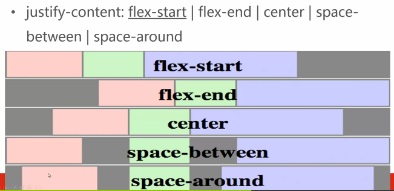
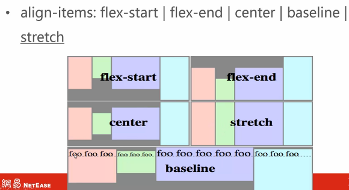
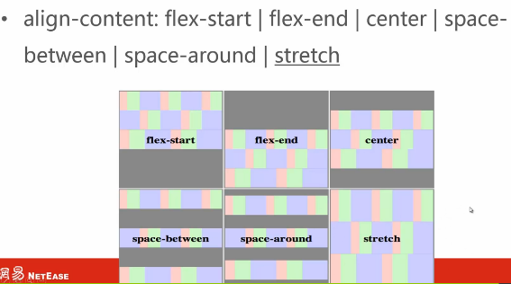

### 什么是布局？

简单说，布局就是，将元素以正确的大小摆放在正确的位置上。

### display

display用来设置元素的显示方式

```
display:block|inline|inline-block|none
```

#### block

- 块级元素
- 默认宽度为父元素宽度
- 可以设置宽高
- 换行显示
- 默认block元素：div，p，h1-h6，ul，form……

#### inline

- 行级元素
- 默认宽度为内容宽度
- 不可设置宽高
- 同行显示
- 默认inline元素：span，a，label，cite，em……

#### inline-block

- 默认宽度为内容宽度
- 可设置宽高
- 同行显示
- 整块换行
- 默认inline-block元素：input，textarea，select，button……

#### none

- 设置元素不显示
- 与visibility:hidden相比，都是隐藏元素，但是设置display:none时隐藏的元素不占据位置，visibility:hidden元素所占据的位置还在

#### block vs inline


> 小技巧：怎样块级元素水平居中？

- 元素定义一个宽度
- margin-left和margin-right设置为auto

### 一个例子：居中导航

```html
<ul>
  <li><a href="#">推荐</a></li>
  <li><a href="#">歌单</a></li>
  <li><a href="#">打牌DJ</a></li>
  <li><a href="#">歌手</a></li>
  <li><a href="#">新碟上架</a></li>
</ul>
```

```css
ul{text-align: center;height: 30px;line-height: 30px;}
li,a{display: inline-block;width: 80px;height: 100%;}
li{margin: 0 10px;}
```

### display:inline-block在IE6/7上的兼容问题


### position

position用来设置定位方式

#### 设置位置

top，right，bottom，left分别设置距离上边缘，右边缘，下边缘，左边缘的偏移距离，z-index设置元素的层级深度，即z轴。


如果同时设置top，right，bottom和left，例如`{top:30px;right:30px;bottom:30px;left:30px;}`，未设置width和height时，元素位置将同时满足4各条件，当设置了width或height，或者width与height都设置了，将只满足left或top，或者left与top同时满足。

z-index栈：

两个元素A和B，A的z-index=9，B的z-inde=1，那么A的子元素一定在B的子元素上面，即使A的子元素的z-index大于B的子元素

```
position:static|relative|absolute|fixed
```

默认值static，按照默认文档流排列

##### relative

- 相对定位
- 仍在文档流中
- 参照物是元素本身
- 最常用的场景，改变元素在z轴上的层级，绝对定位元素的参照物

##### absolute

- 绝对定位
- 脱离文档流
- 默认宽度是内容宽度
- 参照物是向上查找的第一个定位祖先/根元素（即离它最近的一个relative或者根元素）

##### fixed

- 固定定位
- 脱离文档流
- 默认宽度是内容宽度
- 参照物是视窗，不会随滚动条滚动
- IE6及以下不支持

### 一个例子：固定顶栏布局

```html
<body>
  <div class="top">top bar</div>
  <div class="main">main content</div>
</body>
```

```css
body{
  margin: 0;
  padding-top: 50px;
}
.top{
  position: fixed;
  background-color: pink;
  top: 0;
  width: 100%;
  height: 50px;
}
.main{
  height: 2000px;
  background-color: #eee;
}
```

### 遮罩布局

关键css：

```css
.shade{
  position:fixed;
  width:100%;
  height:100%;
  top:0;
  left:0;
  z-index:99;
  background-color:rgba(0,0,0,0.5);
}
```

### 三行自适应布局

```html
<div class="head">head</div>
<div class="body">body</div>
<div class="foot">foot</div>
```

```css
.head{
  position: absolute;
  top: 0;
  left: 0;
  width: 100%;
  height: 100px;
}
.body{
  position: absolute;
  top: 100px;
  left: 0;
  bottom: 100px;
  right: 0;
overflow: auto;
}
.foot{
  position: absolute;
  bottom: 0;
  left: 0;
  width: 100%;
  height: 100px;
}
```

### float

```
float:left|right|none|inherit
```

特点：

- 默认宽度为内容宽度
- 向指定方向一直移动
- float的元素在同一文档流
- float元素是脱离文档流（不完全脱离文档流），对元素，是脱离文档流；对内容，在文档流中
- left：左浮动
- right：右浮动

### clear

```
clear:both|left|rught|none|inherit
```

特点：

- 应用于后续元素
- 应用于块级元素

较好的实践：

```css
.clearfix:after{
  content: '.';
  display: block;
  clear: both;
  height: 0;
  overflow: hidden;
  visibility: hidden;
}
.clearfix{
  zoom: 1;
}
```

### 两列布局

关键css：

```
float:left/right;
clearfix清除浮动
```

### flex

一些概念：

- flex container：容器
- flex item：元素
- main axis：主轴
- cross axis：副轴

创建flex container：`display:flex`

flex item：只有flex container的直接子元素，并且是在文档流中的，才被称为它的flex item

#### 方向

##### flex-direction

```
flex-direction:row|row-reverse|column|column-reverse
```

- row：行排列
- row-reverse：行排列，反向
- column：列排列
- column-reverse：列排列，反向

##### flex-wrap

```
flex-wrap:nowrap|wrap|wrap-reverse
```

- nowrap：不换行
- wrap：换行
- wrap-reverse：反向换行

##### flex-flow

```
flex-flow:<'flex-direction'>||<'flex-wrap'>
```

##### order

```
order:<interger>
```

- 初始值是0
- 排列顺序按从小到大
- 它是一个相对值
- 可以是负值，排在正值前面

#### 弹性

##### flex-grow：伸展因子

```
flex-grow:<number>
```

- 初始值为0
- 分得的是剩余空间，即减去flex-basis剩余的部分

##### flex-shrink：收缩因子

```
flex-shrink:<number>
```

- 初始值是1
- 剩余空间为负的时，弹性布局元素宽度计算公式：`=flex-basis+flex-shrink/sum(flex-shrink)*remain`

##### flex-basis

```
flex-basis:main-size|<width>
```

- 设置flex item的初始宽/高
- main-size：主轴的尺寸

##### 弹性布局元素宽度计算公式

`=flex-basis+flex-grow/sum(flex-grow)*remain`

remain表示多余的空间

##### flex

```
flex:<'flex-grow'>||<'flex-shrink'>||<'flex-basis'>
//初始值是0 1 main-size
```

#### 对齐

##### justify-content：设置主轴方向上的对齐方式

```
justify-content:flex-star|flex-end|center|space-between|space-around
```



##### align-items：设置cross-axis方向上的对齐方式

```
align-items:flex-start|flex-end|center|baseline|stretch
```



##### align-self：设置单个flex item在cross-axis方向上的对齐方式

```
align-self:auto|flex-start|flex-end|center|baseline|stretch
```

##### align-content：设置cross-axis方向上行对齐方式

```
align-content:flex-start|flex-end|center|space-between|space-around|stretch
```



#### 三行两列自适应布局

```html
<div class="head">head</div>
<div class="body">
  <div class="side"></div>
  <div class="main"></div>
</div>
<div class="foot">foot</div>
```

```css
html,body{
  height: 100%;
}
body{
  display: flex;
  flex-flow: column;
}
.head,.foot{
  height: 100px;
}
.body{
  flex: 1;
  display: flex;
}
.side{
  width: 200px;
}
.main{
  flex: 1;
  margin-left: 10px;
}
.body{
  width: 1000px;
  align-self: center;
}
```
