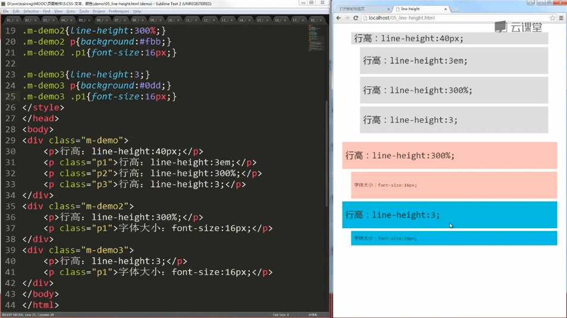
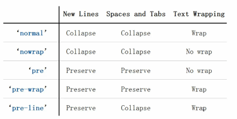

# 字体

#### font-size
语法规则：

```
  font-size:<length>|<percentage>|<absolute-size>|<relative-size>
```
&lt;length&gt;：单位px

&lt;percentage&gt;：单位em或百分比，参照物是父元素字体大小

&lt;absolute-size&gt;：绝对大小，它的值是下面这些
- xx-small
- x-small
- small
- medium
- large
- x-large
- xx-large

&lt;relative-size&gt;：相对大小，它的值有smaller和larger

absolute-size和relative-size在实际开发中不常用

#### font-family
语法规则：

```
font-family:[<family-name>|<generic-family>]#
```
&lt;family-name&gt;：字体名字

&lt;generic-family&gt;：字体族，也就是一种类型的字体，它的值有这些
- serif：衬线体
- sans-serif：非衬线体
- cursive：草书
- fantasy：幻想体
- monospace：等宽字体
- ……

一些例子：
```css
font-family:arial; /*arial只有英文字体*/
font-family:arial,Verdana,sans-serif; /*英文字体用arial,Verdana不起作用,中文字体用sans-serif*/
font-family:Verdana,"microsoft yahei"; /*英文字体用Verdana，中文字体用微软雅黑*/
font-family:"宋体",serif; /*中英文字体都有宋体，serif不起作用*/
```

*有多个值的时候，前面的优先级高*

#### font-weight
语法规则：

```
font-weight:normal(默认)|bold|bolder|lighter|100|200|300|400|500|600|700|800|900
```

#### font-style
语法规则：

```
font-style:normal(默认)|italic|oblique
```
italic：斜体
oblique：把字体倾斜，这个不常用

#### line-height
语法规则：

```
line-height:normal|<number>|<length>|<percentage>
```
normal：取浏览器默认值，一般是1.1~1.2

&lt;number&gt;：继承时直接继承

&lt;percentage&gt;：百分比，继承时，先计算

一个例子：



#### font
语法规则：

```
font:[[<font-style>||<font-variant>||<font-weight>||<font-stretch>]? <font-size>[/<line-height>]?<font-family>]|caption|icon|menu|message-box|small-caption|status-bar
```
例子：

```css
font: 30px/2 "Consolas",monospace;
font: italic bold 20px/1.5 arial,serif;
```
font-size和font-family是必选项

#### color
- red(关键字)
- #f00(16进制值)
- rgb(255,0,0)
- rgba(255,0,0,1)：a表示不透明度
- transparent：透明

# 对齐方式

#### text-align
水平对齐方式
```
text-align:left|right|center|justify
```
- left:左对齐
- right:右对齐
- center:居中对齐
- justify:两端对齐

#### vertical-align
垂直对齐方式
```
vertical-align:baseline|sub|super|top|text-top|middle|bottom|text-bottom|<percentage>|<length>
```
- baseline：默认值，基线对齐
- sub：下标
- super：上标
- top：当前行的最高点
- text-top：文本最高点
- middle
- bottom
- text-bottom
- &lt;percentage&gt;：参照属性是line-height
- &lt;length&gt;：以baseline为起点向上，负值时向下

#### text-indent
文本缩进
```
text-indent:<length>|<percentage>
```
&lt;length&gt;:单位可以是px，也可以是em，当设置为负值时，是向左缩进，当这个值负的足够大时，文本就看不到了，达到隐藏效果

&lt;percentage&gt;:百分比

# 格式处理
#### white-space
```
white-space:normal|nowrap|pre|pre-wrap|pre-line
```


- collapse表示，换行、空格或者tabs会被合并成一个空格
- wrap表示自动换行
- preserve表示，换行、空格或者tabs会被保留
- nowrap主要用来强制不换行
- pre主要用来格式化代码，换行，空格和tabs会被保留，不会自动换行
- pre-wrap和pre区别是，pre-wrap可以自动换行
- pre-line换行会被保留，空格和tabs会被合并，并且可以自动换行

#### word-wrap
```
word-wrap:normal|break-word
```
normal:只在允许的断字点换行（浏览器保持默认处理）

break-word:长单词也会换行

#### word-break
```
word-break:normal|keep-all|break-all
```
normal:使用浏览器默认的换行规则

keep-all:只能在半角空格或连字符处换行

break-all:所有单词，当遇到换行时都换行，即允许在单词内换行

# 文本修饰
#### text-shadow
```
text-shadow:none|[<length>{2,3}&&<color>?]#
```
none:不做阴影，默认值

&lt;length&gt;:第一个值是x轴偏移,第二个值是y轴偏移,第三个值是模糊半径

&lt;color&gt;:当不设置color值时，用文字的color值

例子:
```css
text-shadow :1px 2px #f00;
```

#### text-decoration
```
text-decoration:none|[underline||overline||line-through]
```

# 高级设置

#### text-overflow
```
text-overflow:clip|ellipsis
```
clip:修剪文本

ellipsis:文本溢出时用省略号代替,配合overflow:hidden;white-space:nowrap;可以做单行文本溢出时自动加省略号

#### cursor
```
cursor:[<url>,]*[auto|default|none|help|pointer|zoom-in|zoom-out|move]
```
- &lt;url&gt;:自定义图标
- auto:浏览器默认
- default:指针
- none:鼠标消失
- help:指针旁边有问号
- pointer:手型
- zoom-in:放大镜
- zoom-out:缩小镜
- move:移动光标形状

例子：cursor:url(cur.cur),pointer;

#### inherit
强制继承属性值
