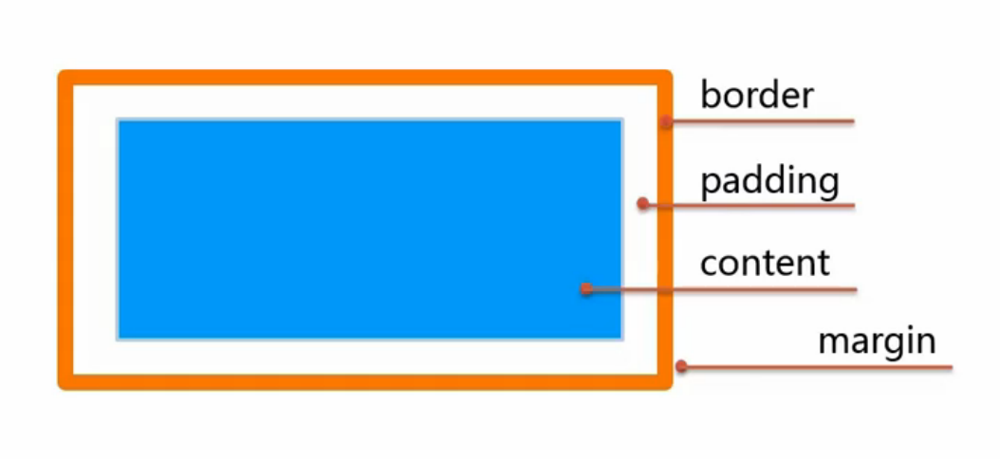
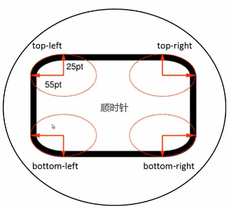

### css盒模型


一个css盒子，从里到外，最里面的是内容content部分，width\*height，然后是内边距padding，然后是边框border，最外面是外边距margin。

### width
```
width:<length>|<percentage>|auto|inherit
```

要注意的地方：
- &lt;percentage&gt;百分比的参照物一般是父元素
- 对inline元素设置无效

它的两个引申属性：max-width，min-width

### height
```
height:<length>|<percentage>|auto|inherit
```

它的特点与width类似，百分比的参照物是父元素，对inline元素设置无效，同样有max-height和min-height这两个属性

### padding
```
padding:[<length>|<percentage>]{1,4}|inherit
```

它的多个属性值，顺序是top，right，bottom，left（顺时针）

百分比参照物是父元素

引申属性有：padding-top、padding-right、padding-bottom、padding-left

值缩写例子：
`padding:20px;` == `padding:20px 20px 20px 20px;`

`padding:20px 10px;` == `padding:20px 10px 20px 10px;`

`padding:20px 10px 30px;` == `padding:20px 10px 30px 10px;`

总结规则：对面相等，后者省略；4面相等，只设一个

### margin
```
margin:[<length>|<percentage>|auto]{1,4}|inherit
```

与padding类似，属性值顺序是顺时针的，百分比参照物是父元素，值缩写规则也相同

引申属性：margin-top、margin-right、margin-bottom、margin-left

关于margin合并：
- 相邻元素的margin值会合并，即margin值取最大的那个值
- 父元素与第一个/最后一个子元素margin也会合并

参考：[margin外边距塌陷](https://developer.mozilla.org/zh-CN/docs/Web/CSS/margin_collapsing "margin外边距塌陷")

margin有一个很常用的应用，块级元素水平居中，`margin: 0 auto;`

### border
```
border:[<border-width>||<border-style>||<border-color>]|inherit
<border-width>:[<length>|thin|medium|thick]{1,4}|inherit
<border-style>:[solid|dashed|dotted|...]{1,4}|inherit
<border-color>:[<color>|transparent]{1,4}|inherit
```

### border-radius
```
border-radius:[<length>|<percentage>]{1,4}[/[length|<percentage>]{1,4}]?
```



border-radius:水平半径/垂直半径;

几个例子：
```css
border-radius:10px;
border-radius:0px 5px 10px 15px/20px 15px 10px 5px;

border-radius:50%; //正圆
border-left-top-radius:10px; //左上角圆角
```

### overflow
```
overflow:visible|hidden|scroll|auto
```

溢出显示规则：
- visible，超出部分依然显示
- hidden，超出部分隐藏
- scroll，一直显示滚动条
- auto，超出时显示滚动条

引申属性：overflow-x和overflow-y，分别是水平方向和垂直方向

### box-sizing
```
box-sizing:content-box|border-box|inherit
```

- content-box:内容盒子
- border-box:带内边距和边框

### box-shadow
```
box-shadow:none|<shadow>[,<shadow>]*
<shadow>:inset?&&<length>{2,4}&&<color>?
```

- inset表示是内阴影
- 阴影不占空间

一个例子：
```css
box-shadow:4px 6px 3px 0px red;
//第一个length值是水平偏移
//第二个length值是垂直偏移
//第三个length值是模糊半径
//第四个length值是阴影大小
```

### outline
```
outline:[<outline-width>||<outline-style>||<outline-color>]|inherit
<outline-width>:<length>|thin|medium|thick|inherit
<outline-style>:solid|dashed|dotted|...|inherit
<outline-color>:<color>|invert|inherit
```

- invert表示和当前背景色是相反色
- 不占空间
- 在border外
