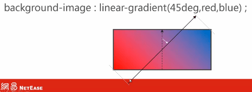
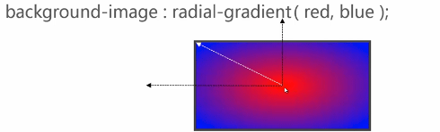
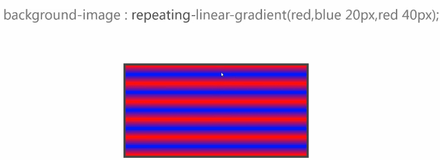
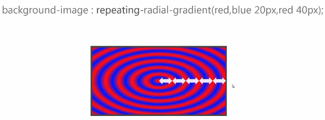

### background-color
```
background-color:<color>;
```
背景颜色，在最底层。

### background-image
```
background-image:<bg-image>[,<bg-image>]*
<bg-image>:<image>|none
```
一个例子：
```css
background-image:url(red.png),url(blue.png);
//第一个图片在最上一层，后面的图片依次往下排
```

### background-repeat
```
background-repeat:<repeat-style>[,<repeat-style>]*
<repeat-style>:repeat-x|repeat-y|[repeat|space|round|no-repeat]{1,2}
```
- repeat-x：沿x轴平铺
- repeat-y：沿y轴平铺
- repeat：沿x轴和y轴平铺
- space：在平铺的同时，图片之间留有空隙
- round：图片伸缩平铺
- no-repeat：不平铺

### background-attachment
```
background-attachment:<attachment>[,<attachment>]*
<attachment>:scroll|fixed|local
```
- scroll：（默认值）背景图不动
- fixed：参照物是整个窗口，背景图像相对于窗体固定
- local：背景图随滚动条滚动

### background-position
```
background-position:<position>[,<position>]*
<position>:[left|center|right|top|bottom|<percentage>|<length>]|[left|center|right|<percentage>|<length>]  [top|center|bottom|<percentage>|<length>]|[center|[left|right][<percentage>|<length>]?]&&[center|[top|bottom][<precentage>|<length>]?]
```
当设置为百分比时，表示图片的百分比和容器的百分比重合的那个点，例如：`background-position:50% 50%;`表示背景图片的50%点（即背景图片的中心点）和容器的50%点（即容器的中心点）重合，所以这个设置的效果是背景图片在容器中居中显示

例子：
```css
background-position:right 10px top 20px;//表示距离右边10px，距离上边20px
background-position:-10px -100px;//表示背景图片x轴向左偏移10px，y轴向上偏移100px，负值表示反方向偏移（即x轴向左，y轴向上）
```

### linear-gradient()
线性渐变
```
[[<angle>|to <side-or-corner>],]?<color-stop>[,<color-stop>]+
<angle> //角度
<side-or-corner>:[left|right]||[top|bottom]
<color-stop>:<color>[<percentage>|<length>]?
```
几个例子：
```css
background-image:linear-gradient(red,blue);//从红色渐变到蓝色，方向是默认方向，从上到下
background-image:linear-gradient(to top,red,blue);//从红色渐变到蓝色，方向是从下到上
background-image:linear-gradient(to right bottom,red,blue);//方向是左上角到右下角
background-image:linear-gradient(45deg,red,blue);//角度是45度，0度是从下到上，顺时针为正
background-image:linear-gradient(red,green,blue);//从红色渐变到绿色，再渐变到蓝色
//第一个颜色，如果位置是缺省的，就默认是0%
//最后一个颜色，如果位置是缺省的，就默认是100%
//中间颜色，如果位置是缺省的，就自动平分
```



### radial-gradient
径向渐变
```
[[circle||<length>][at <position>]?,|[ellipse||[<length>|<percentage>]{2}][at<position>]?,|[[circle|ellipse]||<extent-keyword>][at<position>]?,|at<position>,]?  <color-stop>[,<color-stop>]+
circle//圆形
ellipse//椭圆
<extent-keyword>:closest-side|farthest-side|closest-corner|farthest-corner
closest-side//离圆心最近的那条边
farthest-side//离圆心最远的那条边
closest-corner//离圆心最近的那个角
farthest-corner//离圆心最远的那个角(默认值)
```
几个例子：
```css
background-image:radial-gradient(circle 100px,red,blue);//圆的半径是100px
background-image:radial-gradient(red,blue);//默认是椭圆
background-image:radial-gradient(100px 50px,red,blue);//x轴半径是100px，y轴半径是50px的椭圆
background-image:radial-gradient(100px 50px at 0 0,red,blue);//at 0 0 表示圆心在0,0这个点
background-image:radial-gradient(red,green 20%,blue);//三色渐变
```



### repeating-\*-gradient
例子：
```css
background-image:repeating-linear-gradient(red,blue 20px,red 40px);
background-image:repeating-radial-gradient(red,blue 20px,red 40px);
```





### background-origin
背景显示原点设置
```
background-origin:<box>[,<box>]*
<box>:border-box|padding-box|content-box
默认值是padding-box
```

### background-clip
背景显示区域裁剪
```
background-clip:<box>[,<box>]*
<box>:border-box|padding-box|content-box
默认值是border-box
```

### background-size
背景尺寸大小
```
background-size:<bg-size>[,<bg-size>]*
<bg-size>:[<length>|<percentage>|auto]{1,2}|cover|contain
<percentage>//百分比，相对于容器
cover//背景图片撑满整个容器，背景图片尽可能的小，但宽度和高度都不能小于容器
contain//背景图片尽可能的大，但宽度和高度都不能大于容器
```

### background
```
background:[<bg-layer>,]* <final-bg-layer>
<bg-layer>:<bg-image>||<position>[/<bg-size>]?||<repeat-style>||<attachment>||<box>||<box>//第一个<box>是background-origin,第二个<box>是background-clip
<final-bg-layer>:<bg-layer>||<'background-color'>
```
