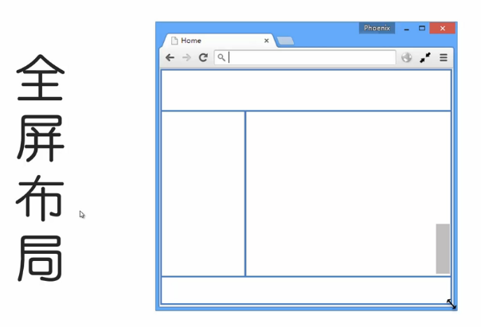
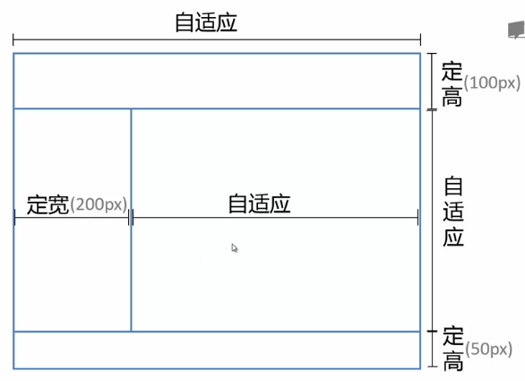
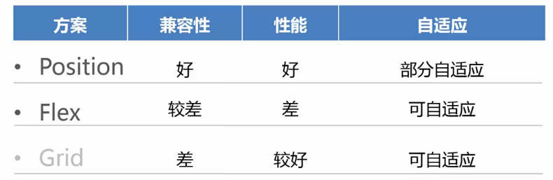

# 居中布局

### 水平布局

需求：parent，child元素宽度不定，要求child水平居中

```html
<div class="parent">
  <div class="child">
    DEMO
  </div>
</div>
```

方案一：

```css
.parent{
  text-align: center;
}
.child{
  display: inline-block;
}
```

缺点：需兼容IE6 inline-block

方案二：

```css
.child{
  display: table;
  margin: 0 auto;
}
```

缺点：IE6需要改html结构，table

方案三：

```css
.parent{
  position: relative;
}
.child{
  position: absolute;
  left: 50%;
  transform: translateX(-50%);
}
```

缺点：transform在低版本浏览器不被支持

方案四：

```css
.parent{
  display: flex;
  justify-content: center;
}
```

缺点：flex在低版本浏览器不被支持

### 垂直居中

需求：parent和child高度不定，要求child垂直居中。

```html
<div class="parent">
  <div class="child">
    DEMO
  </div>
</div>
```

方案一：

```css
.parent{
  display: table-cell;
  vertical-align: middle;
}
```

缺点：低版本浏览器需兼容table-cell

方案二：

```css
.parent{
  position: relative;
}
.child{
  position: absolute;
  top: 50%;
  transform: translateY(-50%);
}
```

缺点：transform在低版本浏览器不被支持

方案三：

```css
.parent{
  display: flex;
  align-items: center;
}
```

缺点：flex在低版本浏览器不被支持

### 居中

需求：parent和child宽度和高度不定，要求child水平垂直居中。

```html
<div class="parent">
  <div class="child">
    DEMO
  </div>
</div>
```

方案一：

```css
.parent{
  text-align: center;
  display: table-cell;
  vertical-align: middle;
}
.child{
  display: inline-block;
}
```

方案二：

```css
.parent{
  position: relative;
}
.child{
  position: absolute;
  left: 50%;
  top: 50%;
  transform: translate(-50%,-50%);
}
```

方案三：

```css
.parent{
  display: flex;
  justify-content: center;
  align-items: center;
}
```

# 多列布局

### 定宽 + 自适应

需求：一列定宽 + 一列自适应

```html
<div class="parent">
  <div class="left">
    <p>left</p>
  </div>
  <div class="right">
    <p>right</p>
    <p>right</p>
  </div>
</div>
```

方案一：float + margin

```css
.left{
  float: left;
  width: 100px;
}
.right{
  margin-left: 120px;
}
```

缺点：在IE6上需要css hack，另外，如果.right中有清除浮动，则.right会掉到下面一行

改进方案二：float + margin + （fix）

```html
<div class="parent">
  <div class="left">
    <p>left</p>
  </div>
  <div class="right-fix">
    <div class="right">
      <p>right</p>
      <p>right</p>
    </div>
  </div>
</div>
```

```css
.left{
  float: left;
  width: 100px;
  position: relative;
}
.right-fix{
  float: right;
  width: 100%;
  margin-left: -100px;
}
.right{
  margin-left: 120px;
}
```

方案三：float + overflow

```css
.left{
  float: left;
  width: 100px;
  margin-right: 20px;
}
.right{
  overflow: hidden;
}
```

缺点：不兼容IE6

方案四：table

```css
.parent{
  display: table;
  width: 100%;
  table-layout: fixed;
}
.left, .right{
  display: table-cell;
}
.left{
  width: 100px;
  padding-right: 20px;
}
```

方案五：flex

```css
.parent{
  display: flex;
}
.left{
  width: 100px;
  margin-right: 20px;
}
.right{
  flex: 1;
}
```

需求：多列定宽 + 一列自适应

```html
<div class="parent">
  <div class="left">
    <p>left</p>
  </div>
  <div class="center">
    <p>center</p>
  </div>
  <div class="right">
    <p>right</p>
    <p>right</p>
  </div>
</div>
```

```css
.left, .center{
  float: left;
  width: 100px;
  margin-right: 20px;
}
.right{
  overflow: hidden;
}
```

### 不定宽 + 自适应

需求：一列不定宽 + 一列自适应

方案一：float + overflow

```css
.left{
  float: left;
  width: 100px; /* 宽度可更改 */
  margin-right: 20px;
}
.right{
  overflow: hidden;
}
/* 或者只设置left的内容宽度 */
.left p{
  width: 200px;
}
```

方案二：table

```css
.parent{
  display: table;
  width: 100%;
  table-layout: fixed; /* 如果不定宽列的宽度由内容决定，需要去掉这行代码 */
}
.left, .right{
  display: table-cell;
}
.left{
  width: 100px; /* 宽度可更改，如果宽度由内容决定，需要设置为 width:0.1% */
  padding-right: 20px;
}
.left p{
  width: 200px;
}
```

方案三：flex

```css
.parent{
  display: flex;
}
.left{
  width: 100px; /* 宽度可更改 */
  margin-right: 20px;
}
.right{
  flex: 1;
}
```

需求：两列不定宽 + 一列自适应

```html
<div class="parent">
  <div class="left">
    <p>left</p>
  </div>
  <div class="center">
    <p>center</p>
  </div>
  <div class="right">
    <p>right</p>
    <p>right</p>
  </div>
</div>
```

```css
.left, .center{
  float: left;
  margin-right: 20px;
}
.right{
  overflow: hidden;
}
.left p, .right p{
  width: 200px;
}
```

### 等分布局

```html
<div class="parent">
  <div class="column"><p>1</p></div>
  <div class="column"><p>2</p></div>
  <div class="column"><p>3</p></div>
  <div class="column"><p>4</p></div>
</div>
```

方案一：float

```css
.parent{
  margin-left: -20px;
}
.column{
  float: left;
  width: 25%;
  padding-left: 20px;
  box-sizing: border-box;
}
```

方案二：table

```html
<div class="parent-fix">
  <div class="parent">
    <div class="column"><p>1</p></div>
    <div class="column"><p>2</p></div>
    <div class="column"><p>3</p></div>
    <div class="column"><p>4</p></div>
  </div>
</div>
```

```css
.parent-fix{
  margin-left: -20px;
}
.parent{
  display: table;
  width: 100%;
  table-layout: fixed;
}
.column{
  display: table-cell;
  padding-left: 20px;
}
```

方案三：flex

```css
.parent{
  display: flex;
}
.column{
  flex: 1;
}
.column + .column{
  margin-left: 20px;
}
```

### 等高

```html
<div class="parent">
  <div class="left">
    <p>left</p>
  </div>
  <div class="right">
    <p>right</p>
    <p>right</p>
  </div>
</div>
```

方案一：table

```css
.parent{
  display: table;
  width: 100%;
  table-layout: fixed;
}
.left, .right{
  display: table-cell;
}
.left{
  width: 100px;
  padding-right: 20px;
}
```

方案二：flex

```css
.parent{
  display: flex;
}
.left{
  width: 100px;
  margin-right: 20px;
}
.right{
  flex: 1;
}
```

方案三：float

```css
.parent{
  overflow: hidden;
}
.left, .right{
  padding-bottom: 9999px;
  margin-bottom: -9999px;
}
.left{
  float: left;
  width: 100px;
  margin-right: 20px;
}
.right{
  overflow: hidden;
}
```

# 全屏布局

### 全屏布局是怎么的一种布局，有什么特点？



全屏布局，一般顶部是一级导航和二级导航，底部是页脚，中间分为两列，左边一列是定宽的菜单栏，右边一列是自适应的显示区域，这样的结构始终显示在屏幕的可视区域。

需求：



方案一：position

```html
<div class="parent">
  <div class="top">top</div>
  <div class="left">left</div>
  <div class="right">
    <div class="inner">right</div>
  </div>
  <div class="bottom">bottom</div>
</div>
```

```css
html, body, .parent{
  height: 100%;
  overflow: hidden;
}
.top{
  position: absolute;
  left: 0;
  right: 0;
  top: 0;
  height: 100px;
}
.left{
  position: absolute;
  left: 0;
  top: 100px;
  bottom: 50px;
  width: 200px;
}
.right{
  position: absolute;
  overflow: auto;
  left: 200px;
  right: 0;
  top: 100px;
  bottom: 50px;
}
.bottom{
  position: absolute;
  left: 0;
  right: 0;
  bottom: 0;
  height: 50px;
}
.right .inner{
  min-height: 1000px;
}
```

方案二：flex

```html
<div class="parent">
  <div class="top">top</div>
  <div class="middle">
    <div class="left">left</div>
    <div class="right">
      <div class="inner">right</div>
    </div>
  </div>
  <div class="bottom">bottom</div>
</div>
```

```css
html, body, .parent{
  height: 100%;
  overflow: hidden;
}
.parent{
  display: flex;
  flex-direction: column;
}
.top{
  height: 100px;
}
.bottom{
  height: 50px;
}
.middle{
  flex: 1;
  display: flex;
}
.middle .left{
  width: 200px;
}
.middle .right{
  flex: 1;
  overflow: auto;
}
.middle .right .inner{
  min-height: 1000px;
}
```

需求变更，在原来需求基础上，定高、定宽部分变成百分比。

实现方案只需要把原来两个方案中的px换成百分比即可，position方案中定位的单位也要换成百分比。

需求再变更，在原来需求基础上，定高、定宽部分变成自适应，即由内容决定宽度或高度。

对于这样的需求，方案一position不能实现。

方案：flex，把定宽、定高部分的设置去掉即可

```css
html, body, .parent{
  height: 100%;
  overflow: hidden;
}
.parent{
  display: flex;
  flex-direction: column;
}
.middle{
  flex: 1;
  display: flex;
}
.middle .right{
  flex: 1;
  overflow: auto;
}
.middle .right .inner{
  min-height: 1000px;
}
```

总结：


